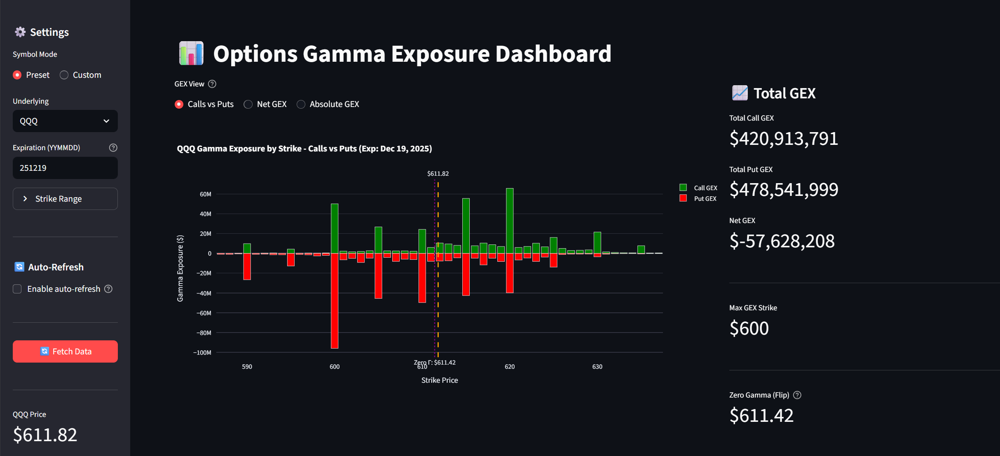
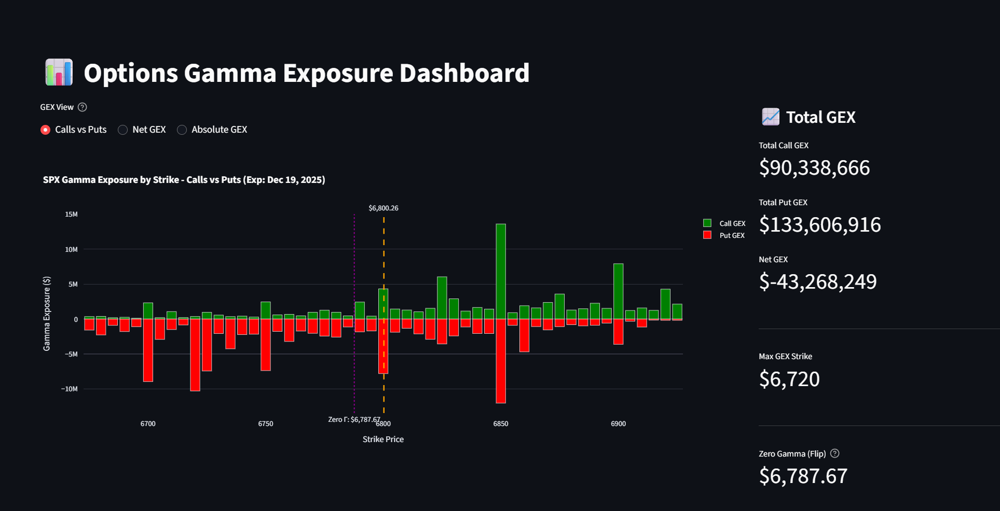
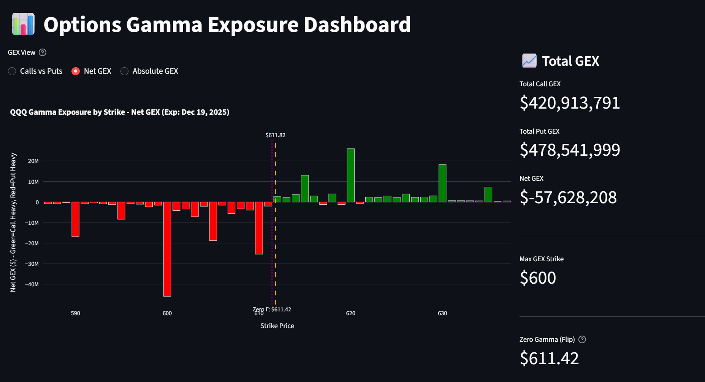
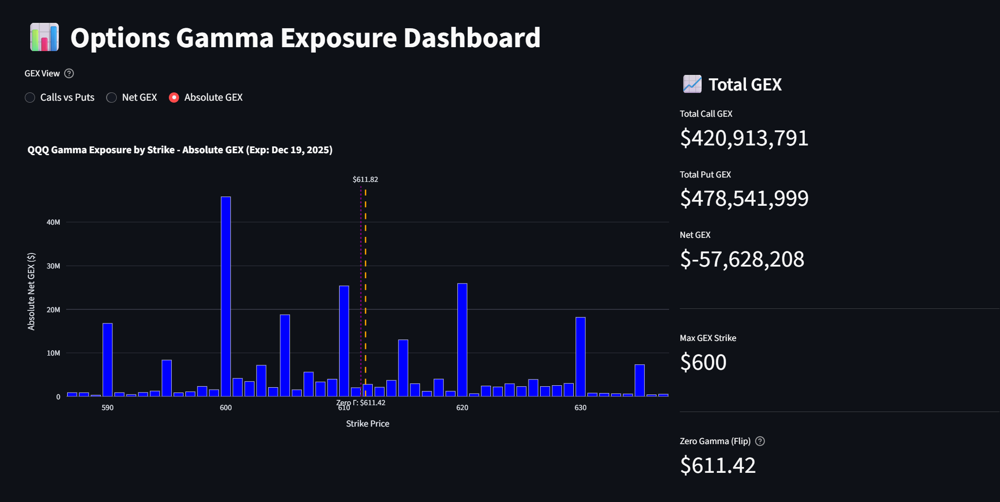
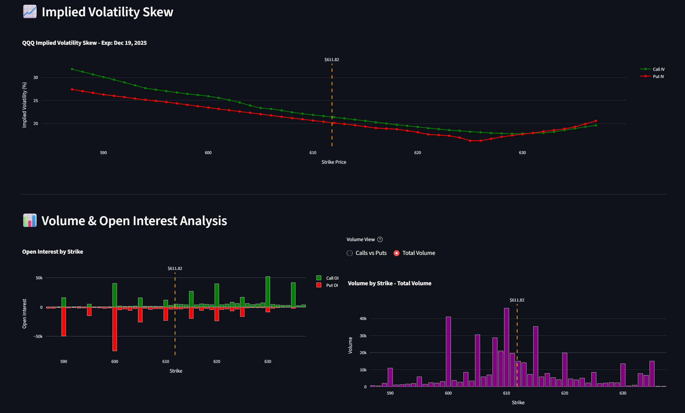

# Options Gamma Exposure (GEX) Dashboard

A real-time Streamlit dashboard for monitoring options gamma exposure (GEX), volume, and open interest using the Tastytrade API and dxFeed WebSocket.

**Supports:** SPX, NDX, SPY, QQQ, IWM, DIA, and custom symbols


---

## 📸 Dashboard Preview



*Live GEX analysis with real-time market data*

---

## 🚀 Quick Start

### Prerequisites

1. **Python 3.8+** - [Download here](https://www.python.org/downloads/)
   - ⚠️ Check "Add Python to PATH" during installation

2. **Tastytrade Account with API Access**
   - [Sign up at tastytrade.com](https://tastytrade.com)

### Installation

**Option 1: Easy Install (Windows)**
```bash
# Double-click to install everything automatically:
install_requirements.bat
```

**Option 2: Manual Install**
```bash
# 1. Install dependencies
pip install -r requirements.txt

# 2. Configure API credentials (see setup below)
copy .env.example .env
# Edit .env with your credentials

# 3. Run the dashboard
start_simple_dashboard.bat
```

Dashboard opens at: **http://localhost:8501**

---

## 🧪 Try the Demo (No API Required!)

**Want to test the dashboard without setting up API credentials?**

```bash
# Just double-click:
start_demo_dashboard.bat
```

**Demo Features:**
- ✅ No API credentials needed
- ✅ **Confirmed working**: SPX and SPY ✅
- ✅ Perfect for testing and screenshots
- ⚠️ Data is delayed (not real-time, ~15-20 min)
- ⚠️ Other symbols (NDX, QQQ, etc.) not available on demo endpoint


**Use Case:** Great for trying out the dashboard, taking screenshots, learning GEX analysis before setting up full API access. Other symbols can be attempted but likely won't return data.

---

## 🔑 Getting Tastytrade API Credentials

### Step-by-Step:

1. **Log into Tastytrade** → Go to **Manage → My Profile → API**

2. **Opt into API Access**
   - Enable API access if not already enabled
   - Agree to terms

3. **Copy your credentials:**
   - **Client ID** - Copy and save
   - **Client Secret** - Click "Show" and copy

4. **Create OAuth Application:**
   - Click "Create OAuth Application" or "Generate Refresh Token"
   - Name it (e.g., "GEX Dashboard")

5. **Get Refresh Token:**
   - ⚠️ **CRITICAL**: Token shown **only once**!
   - Copy immediately

6. **Add to `.env` file:**
   ```env
   CLIENT_ID=your_client_id_here
   CLIENT_SECRET=your_client_secret_here
   REFRESH_TOKEN=your_refresh_token_here
   ```

   **Important:**
   - NO quotes around values
   - NO spaces around `=` sign

7. **Test credentials:**
   ```bash
   python get_access_token.py
   ```

   Should see: `✅ Access token obtained!`

**Official Documentation:** [Tastytrade API Getting Started](https://developer.tastytrade.com/getting-started/)

---

## ✨ Features

### GEX Analysis
- **Three visualization modes:**
  - Calls vs Puts (separate bars)
  - Net GEX (call - put)
  - Absolute GEX (magnitude only)
- **Zero Gamma (Gamma Flip) level** - Shows where dealers flip from long to short gamma
- **Max GEX Strike** - Identifies the gamma magnet strike

**Calls vs Puts View**



**Net GEX View**



**Absolute GEX View**



### Market Data
- **Implied Volatility Skew** - Call vs Put IV across strikes
- **Volume Analysis** - Intraday trading activity by strike
- **Open Interest** - Total contracts outstanding
- **Top Strikes Tables** - By OI, Volume, and Put/Call Ratio

**Volume, Open Interest & IV Skew Analysis**



### Technical Features
- **Auto-refresh** - Configurable 30-300 second intervals
- **Automatic token management** - No manual refresh needed
- **Custom symbol support** - Trade any underlying with options
- **Weekend compatible** - Shows Friday's closing data

---

## 📊 Dashboard Sections

### 1. Symbol Configuration
- Preset symbols: SPX, NDX, SPY, QQQ, IWM, DIA
- Custom mode: Enter any symbol with custom parameters
- Expiration date selector (YYMMDD format)
- Adjustable strike range (±50 strikes)

### 2. GEX Metrics
- Total Call GEX
- Total Put GEX
- Net GEX (Call - Put)
- Max GEX Strike (largest absolute net GEX)
- **Zero Gamma Level** (where Net GEX crosses zero)

### 3. Charts
- Gamma Exposure by Strike
- Implied Volatility Skew
- Open Interest (Calls vs Puts)
- Volume Analysis

### 4. Top Strikes
- By Total Open Interest
- By Total Volume
- By Put/Call Ratio (bearish sentiment)

---

## 🛠️ Technical Details

### Architecture
- **Data Source:** Tastytrade API + dxFeed WebSocket
- **Update Frequency:** On-demand (button click) or auto-refresh
- **GEX Formula:** `Gamma × Open Interest × 100 × Spot Price`
- **Token Management:** Automatic refresh with expiration checking

### Files
- `simple_dashboard.py` - Main dashboard application (real-time data, all symbols)
- `demo_dashboard.py` - Demo dashboard (no API required, delayed data, experiment with symbols)
- `utils/auth.py` - Token management with auto-refresh
- `utils/gex_calculator.py` - Thread-safe GEX calculations
- `install_requirements.bat` - Automated dependency installer (Windows)
- `start_simple_dashboard.bat` - Dashboard launcher (Windows)
- `start_demo_dashboard.bat` - Demo dashboard launcher (Windows)

### Token Management (Automatic)
- **Access Token:** 15-min expiry, refreshes when <60s remaining
- **Streamer Token:** ~20-hour expiry, refreshes when <5min remaining
- Completely transparent - no manual intervention needed

---

## 📖 Understanding the Data

### Zero Gamma (Gamma Flip)
The strike where Net GEX crosses zero:
- **Above Zero Gamma:** Dealers long gamma (stabilizing) - buy dips, sell rallies
- **Below Zero Gamma:** Dealers short gamma (destabilizing) - buy rallies, sell dips
- Acts as support/resistance in low volatility

### Max GEX Strike
The strike with largest absolute net GEX:
- **Gamma magnet** - Price gravitates here during calm markets
- High dealer hedging activity
- Often provides support/resistance

### IV Skew
- **SPX/NDX (European options):** Calls and puts at same strike have identical IV (put-call parity)
- **SPY/QQQ (American options):** Slight differences due to early exercise premium
- Skew appears **across strikes**, not within same strike

---

## 🐛 Troubleshooting

### "python is not recognized"
- Python not in PATH
- Reinstall Python, check "Add Python to PATH"

### "ModuleNotFoundError"
```bash
pip install -r requirements.txt
```

### Token Errors (401)
- Verify `.env` credentials (no quotes, no spaces)
- Check REFRESH_TOKEN is valid
- Automatic refresh should handle this - if persistent, delete token files

### No Data on Weekends
- Expected behavior
- Shows Friday's closing data
- Live updates: Mon-Fri 9:30 AM - 4:00 PM ET

---

## 📚 Additional Resources

- **Technical Documentation:** See `CLAUDE.md` for detailed architecture
- **Tastytrade API:** [developer.tastytrade.com](https://developer.tastytrade.com)
- **Python Download:** [python.org/downloads](https://www.python.org/downloads/)
- **Streamlit Docs:** [docs.streamlit.io](https://docs.streamlit.io)

---


## 📄 License

This project is for educational and personal use. Use at your own risk. Not financial advice.

---

**Questions?** Check `CLAUDE.md` for comprehensive technical documentation.

**Issues?** Verify credentials in `.env` and test with `python get_access_token.py`
